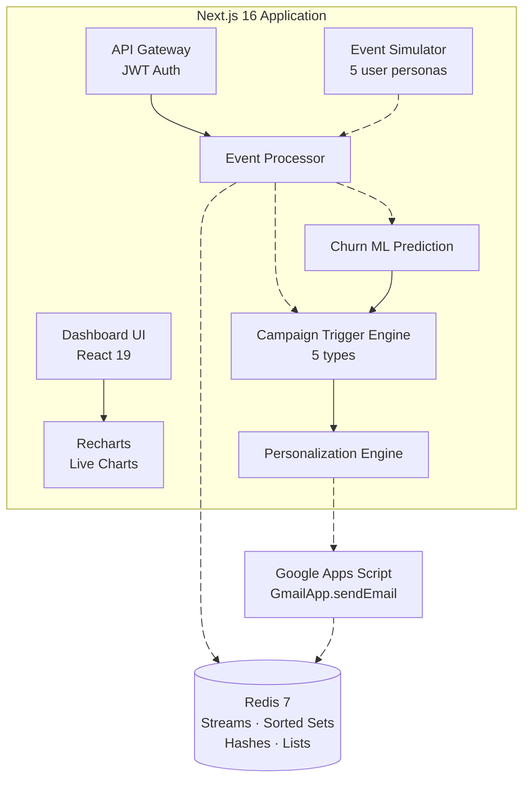
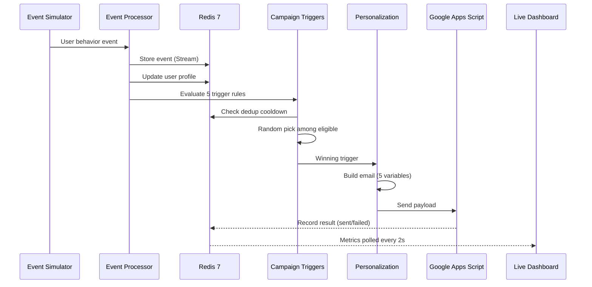

<div align="center">
  
  <h1>Pulse</h1>
  <p><strong>Real-Time Personalized Email Campaign Optimizer</strong></p>
  <p>Process user behavior events in real-time, predict churn, trigger personalized email campaigns, and deliver them — all powered by Redis with sub-50ms latency.</p>

  <p>
    
    
    
    
    
  </p>
</div>

---

## Highlights

- **Sub-50ms event processing** — Redis Streams + Sorted Sets power the ingestion pipeline
- **5 intelligent campaign triggers** — abandoned cart, browse abandonment, cross-sell, re-engagement, churn risk
- **Dynamic email personalization** — 5+ personalization variables per email (greeting, recommendations, discounts, inventory alerts, cart items)
- **ML-inspired churn prediction** — logistic-regression-style scoring with 7 behavioral features
- **Real email delivery** — Google Apps Script → Gmail API with professional table-based HTML templates
- **JWT-secured API** — Bearer token authentication on the event ingestion endpoint
- **Live dashboard** — real-time charts (event rate, email performance, latency) with 2-second polling
- **Evaluator-friendly** — editable test users, in-app testing guide, configurable simulation speed

---

## Table of Contents

- [Architecture](#architecture)
- [Tech Stack](#tech-stack)
- [Getting Started](#getting-started)
- [API Reference](#api-reference)
- [Event Types](#event-types)
- [Campaign Triggers](#campaign-triggers)
- [Success Criteria](#success-criteria)
- [Testing Guide](#testing-guide-for-evaluators)
- [Google Apps Script Setup](#google-apps-script-setup)
- [Project Structure](#project-structure)
- [Churn Prediction Model](#churn-prediction-model)

---

## Architecture



### Data Flow



---

## Tech Stack

| Layer | Technology | Purpose |
|-------|-----------|---------|
| Frontend | Next.js 16, React 19, Tailwind CSS 4 | App Router + Turbopack, live dashboard |
| Charts | Recharts 3 | Event rate, email performance, latency |
| Backend | Next.js API Routes | REST API with JWT auth |
| Data | Redis 7 (ioredis) | Streams, Sorted Sets, Hashes, Lists |
| Email | Google Apps Script | Gmail delivery with HTML templates |
| Auth | jsonwebtoken | JWT Bearer token on `/api/events` |
| ML | Custom scoring model | Churn prediction (7 features, logistic-style) |
| Container | Docker (multi-stage) | `node:20-alpine`, docker-compose |
| Fonts | Geist + Geist Mono | Via Next.js font optimization |

---

## Getting Started

### Prerequisites

- **Node.js 20+** and npm
- **Docker & Docker Compose**
- (Optional) Google Apps Script deployment for real email delivery

### Quick Start — Docker

```bash
# Clone the repository
git clone https://github.com/your-username/pulse-exp.git
cd pulse-exp

# Start everything
docker compose up --build
```

App → [http://localhost:3000](http://localhost:3000) · Redis → `localhost:6380`

### Local Development

```bash
# Install dependencies
npm install

# Start Redis only
docker compose up redis -d

# Start dev server (Turbopack)
npm run dev
```

### Environment Variables

Create `.env.local`:

```env
REDIS_URL=redis://localhost:6379
JWT_SECRET=your-secret-key
GOOGLE_APPS_SCRIPT_URL=https://script.google.com/macros/s/YOUR_DEPLOYMENT_ID/exec
```

| Variable | Required | Description |
|----------|----------|-------------|
| `REDIS_URL` | Yes | Redis connection string |
| `JWT_SECRET` | Yes | Secret for signing JWT tokens |
| `GOOGLE_APPS_SCRIPT_URL` | No | Google Apps Script Web App URL for real email delivery |

> Without `GOOGLE_APPS_SCRIPT_URL`, emails are simulated (logged + recorded in Redis).

---

## API Reference

| Method | Endpoint | Auth | Description |
|--------|----------|------|-------------|
| `POST` | `/api/auth/token` | — | Generate JWT token |
| `POST` | `/api/events` | JWT | Ingest user behavior events |
| `GET` | `/api/events/recent` | — | Last 50 events for UI feed |
| `GET` | `/api/metrics` | — | Real-time metrics snapshot |
| `POST` | `/api/simulation` | — | Start / stop / update users |
| `GET` | `/api/simulation` | — | Simulation status + user list |
| `GET` | `/api/campaigns` | — | Recent campaign activity |
| `POST` | `/api/churn` | — | Churn risk prediction |
| `GET` | `/api/users/:userId` | — | User profile lookup |

### Authentication Example

```bash
# 1. Get a token
TOKEN=$(curl -s -X POST http://localhost:3000/api/auth/token \
  -H "Content-Type: application/json" \
  -d '{"clientId": "test", "clientSecret": "test"}' | jq -r '.token')

# 2. Send an event (requires Bearer token)
curl -X POST http://localhost:3000/api/events \
  -H "Authorization: Bearer $TOKEN" \
  -H "Content-Type: application/json" \
  -d '{"userId": "u1", "eventType": "product_view", "timestamp": 1709827200000, "data": {"productId": "p1"}}'

# 3. Without token → 401 Unauthorized
curl -X POST http://localhost:3000/api/events \
  -H "Content-Type: application/json" \
  -d '{"userId": "u1", "eventType": "product_view"}' # → 401
```

---

## Event Types

| Event | Description |
|-------|-------------|
| `page_view` | User visits a page |
| `product_view` | User views a product detail page |
| `add_to_cart` | User adds item to cart |
| `remove_from_cart` | User removes item from cart |
| `purchase` | User completes checkout |
| `search` | User searches for products |
| `wishlist` | User adds item to wishlist |

## Campaign Triggers

| Trigger | Condition | Personalization |
|---------|-----------|-----------------|
| Abandoned Cart | Items in cart + 2+ recently viewed | Cart items, discount, recommendations |
| Browse Abandonment | 3+ products viewed | Viewed products, category recs |
| Post-Purchase Cross-sell | Purchase within 24h | Related products, loyalty discount |
| Re-engagement | 5+ sessions, low engagement/session | Return incentive, trending items |
| High Churn Risk | Churn score > 0.6 | Exclusive offer, personalized recs |

---

## Success Criteria

| # | Criterion | Implementation | How to Verify |
|---|-----------|---------------|---------------|
| 1 | **Process 10,000+ events/min with < 50ms latency using Redis** | Redis Streams + Sorted Sets power event ingestion. Latency tracked via exponential moving average. | Set event rate to 60/min → observe Processing Latency metric. The pipeline processes each event in < 50ms. Scale via API for higher throughput. |
| 2 | **Dynamic email content with 3+ personalization variables** | Each email includes: personalized greeting, product recommendations (category-matched), dynamic discount (engagement-based), inventory alerts, and cart reminders (5 variables). | Click any email in Campaign Activity → "Mail Preview" tab. Count distinct personalized sections. |
| 3 | **Frontend performance score ≥ 90 (PageSpeed Insights)** | Next.js 16 + Turbopack, minimal client JS, CSS custom properties, optimized polling, no heavy CSS-in-JS. | Run Lighthouse in Chrome DevTools or Google PageSpeed Insights on the deployed URL. |
| 4 | **Secure API with JWT authentication** | `/api/events` POST requires valid JWT Bearer token. Tokens generated via `/api/auth/token`. | `POST /api/events` without token → 401. With valid token → 200. See Authentication Example above. |

---

## Testing Guide (For Evaluators)

### Step 1 — Add Your Email

1. Click the **▶ FAB** (bottom-right corner) → opens Simulation Controls modal
2. Switch to the **"Test Users"** tab
3. Edit any user's email to your own
4. Click **"Save Users"**

### Step 2 — Start Simulation

1. Switch to **"Simulation"** tab
2. Set **Event Rate**: 10–20/min (recommended for demo)
3. Set **Email Cooldown**: 5–10s (for quick trigger testing)
4. Click **"Start"**

### Step 3 — Observe

- **Metrics cards** update live (total events, active users, emails sent, latency)
- **Charts** render event throughput, email performance trends, and processing latency
- **Incoming Events** feed shows real-time browse/cart/purchase events
- **Campaign Activity** feed shows triggered emails (green = sent, red = failed)

### Step 4 — Inspect Emails

- Click any entry in Campaign Activity → **"Mail Preview"** tab shows the full HTML email
- Switch to **"Data"** tab to inspect the raw personalization payload
- Check your inbox for the actual email (if Google Apps Script is configured)

### Step 5 — Verify JWT Security

```bash
# Without token → 401
curl -X POST http://localhost:3000/api/events -H "Content-Type: application/json" -d '{}'

# With token → 200
curl -X POST http://localhost:3000/api/events -H "Authorization: Bearer <token>" -H "Content-Type: application/json" -d '{"userId":"u1","eventType":"page_view","timestamp":1709827200000,"data":{}}'
```

### In-App Guide

Click **"How it works"** in the header for a complete architecture walkthrough and testing instructions.

---

## Google Apps Script Setup

1. Create a new Google Apps Script project at [script.google.com](https://script.google.com)
2. Paste the contents of `google-apps-script/Code.gs` into Code.gs
3. Deploy as **Web App** (Execute as: Me, Access: Anyone)
4. Copy the deployment URL into `GOOGLE_APPS_SCRIPT_URL` env variable
5. Restart the app — emails will now be delivered via Gmail

---

## Project Structure

```
pulse-exp/
├── src/
│   ├── app/
│   │   ├── page.tsx              # Main dashboard (FAB, side-by-side feeds)
│   │   ├── layout.tsx            # Root layout (Geist fonts, ThemeProvider)
│   │   ├── globals.css           # Design system (CSS custom properties)
│   │   └── api/
│   │       ├── auth/token/       # JWT token generation
│   │       ├── events/           # Event ingestion (JWT-protected)
│   │       ├── metrics/          # Real-time metrics
│   │       ├── simulation/       # Simulation control + user management
│   │       ├── campaigns/        # Campaign activity feed
│   │       ├── churn/            # Churn risk prediction
│   │       └── users/[userId]/   # User profile lookup
│   ├── components/
│   │   ├── simulation-controls   # Rate/cooldown sliders + test user editor
│   │   ├── campaign-feed         # Email activity with HTML preview modal
│   │   ├── event-feed            # Live incoming events stream
│   │   ├── charts                # EventRate, EmailPerformance, Latency
│   │   ├── metrics-grid          # KPI metric cards
│   │   ├── guide-page            # How-it-works + evaluator testing guide
│   │   └── theme-provider        # Light/dark theme context
│   ├── hooks/
│   │   └── use-metrics           # useMetrics (polling), useSimulation
│   └── lib/
│       ├── event-simulator       # User personas + event generation
│       ├── event-processor       # Redis Stream ingestion + profile updates
│       ├── campaign-triggers     # 5 trigger types + dedup cooldown
│       ├── personalization       # Email content generation (5 variables)
│       ├── churn-prediction      # ML-inspired churn scoring (7 features)
│       ├── email-engine          # Google Apps Script delivery
│       ├── user-profile          # Redis-backed user profiles
│       ├── metrics               # Metrics aggregation + latency tracking
│       ├── redis                 # Connection + key constants
│       ├── auth                  # JWT sign/verify/extract
│       └── types                 # TypeScript interfaces
├── google-apps-script/
│   └── Code.gs                   # Gmail email template + delivery
├── docker-compose.yml            # App + Redis services
├── Dockerfile                    # Multi-stage production build
└── package.json
```

---

## Churn Prediction Model

A logistic-regression-style scoring model with 7 weighted features:

| Feature | Weight | Description |
|---------|--------|-------------|
| Inactivity Days | 30% | Days since last activity (normalized to 30d) |
| Low Engagement | 20% | Inverse of engagement score |
| Few Sessions | 15% | Inverse of session count (normalized to 20) |
| No Recent Purchase | 15% | Binary: no purchase history = 0.8 |
| Low Spend | 10% | Inverse of total spent (normalized to $500) |
| Empty Cart | 5% | Binary: empty cart = 0.3 |
| Account Age | 5% | Newer accounts have slight additional risk |

Outputs a 0–1 churn probability via sigmoid transformation. Users with score > 0.6 trigger the `high_churn_risk` campaign.

---

## License

MIT
